[](https://github.com/hacs/integration)
[](https://github.com/lizardsystems/hass-mygas/actions/workflows/ci.yml)


Этот репозиторий содержит настраиваемый компонент для Home Assistant для отображения данных из сервиса Мой Газ Смородина.

# Установка

**Способ 1.** [](https://my.home-assistant.io/redirect/hacs_repository/?owner=lizardsystems&repository=hass-mygas&category=integration)
&rarr; Установить

**Способ 2.** Вручную скопируйте папку `mygas`
из [latest release](https://github.com/lizardsystems/hass-mygas/releases/latest) в
директорию `/config/custom_components`.

После установки необходимо перегрузить Home Assistant

# Настройка

[Настройки](https://my.home-assistant.io/redirect/config) &rarr; Устройства и службы
&rarr; [Интеграции](https://my.home-assistant.io/redirect/integrations)
&rarr; [Добавить интеграцию](https://my.home-assistant.io/redirect/config_flow_start?domain=mygas) &rarr; Поиск **MyGas**

или нажмите:

[](https://my.home-assistant.io/redirect/config_flow_start?domain=mygas)

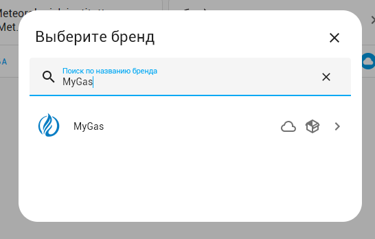

Появится окно настройки интеграции, укажите в нем логин и пароль для доступа в личный кабинет в
сервисе [Мой Газ](https://мойгаз.смородина.онлайн/).

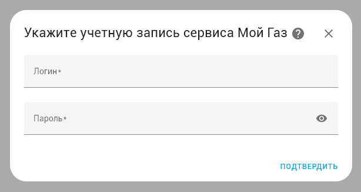

Если вы ввели логин и пароль правильно, то появится сообщение об успешном окончании настройки.

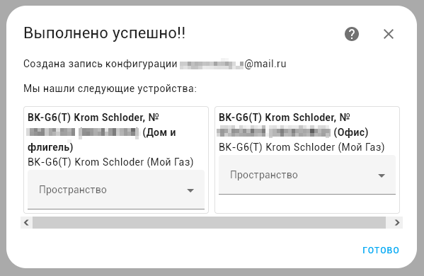

После подключения интеграции на закладке интеграции появится новая интеграция "Мой газ"

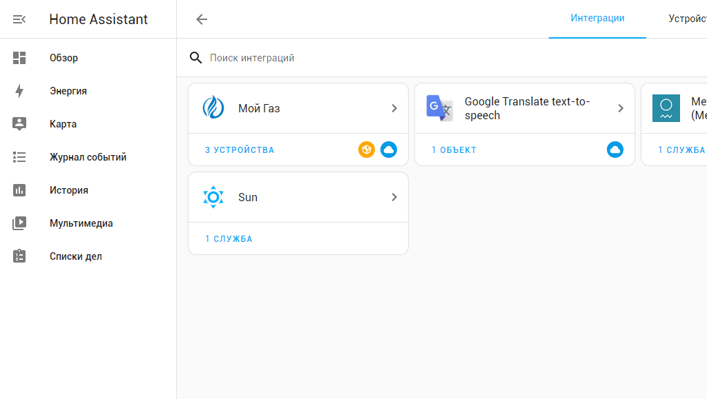

Также вы можете подключить несколько аккаунтов в интеграции. Они будут отображаться в настройках интеграции отдельными строками

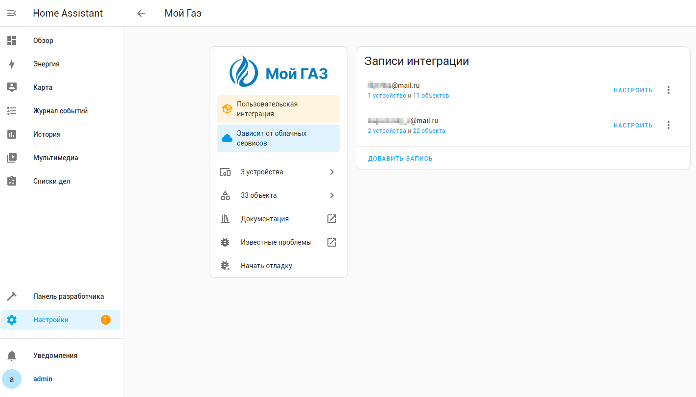

Щелкнув на один из лицевых счетов можно посмотреть устройства или объекты созданные для этого лицевого счета.

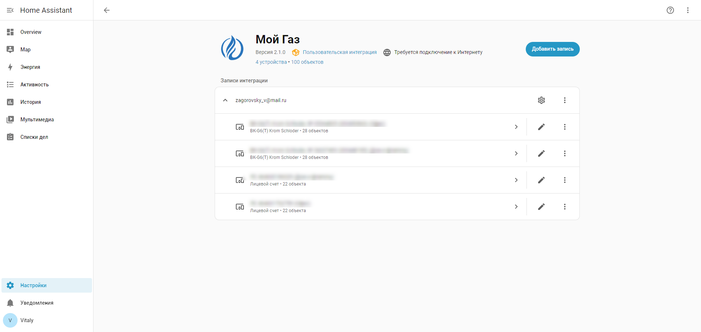

## Иерархия устройств

Для каждого лицевого счета создается **устройство аккаунта** (ЛС). Если в аккаунте есть приборы учета газа, для каждого из них создается **устройство счетчика**, которое отображается как дочернее устройство аккаунта.

```
Устройство аккаунта: ЛС 1234567890 (Офис)
├── Сенсоры: Лицевой счет, Задолженность, Начислено, Оплачено, Задолженность за период,
│            Последнее обновление (+ 13 дополнительных, отключены по умолчанию)
├── Кнопки: Обновить, Получить счет
├── Устройство услуги: Газоснабжение природным газом
│   ├── Сенсор: Balance (баланс по услуге)
│   ├── Сенсор: Плита и колонка(+От) (тарифная ставка)
│   └── Сенсор: Отопление (тарифная ставка)
├── Устройство услуги: Пеня за газ
│   └── Сенсор: Balance (баланс по услуге)
├── Устройство счетчика: BK-G6(T) Krom Schloder, № 05364805 (Офис)
│   ├── Сенсоры: Счетчик, Средний расход, Цена, Показания и др.
│   └── Кнопки: Обновить, Получить счет
└── Устройство счетчика 2 ...
```

Если в аккаунте нет счетчиков, создается только устройство аккаунта с сенсорами и кнопками.
Устройства услуг создаются всегда, если в данных аккаунта присутствуют услуги.

### Именование устройств

- **Устройство аккаунта** — `ЛС {номер_лс} ({алиас})`, например: `ЛС 1234567890 (Офис)`. Если алиас не задан: `ЛС 1234567890`.
- **Устройство услуги** — название услуги из API, например: `Газоснабжение природным газом`, `Пеня за газ`, `Техническое обслуживание`.
- **Устройство счетчика** — `{название_счетчика} ({алиас})`, например: `BK-G6(T) Krom Schloder, № 05364805 (Офис)`. Если алиас не задан, отображается только название счетчика.

Общий вид устройства аккаунта в Home Assistant.

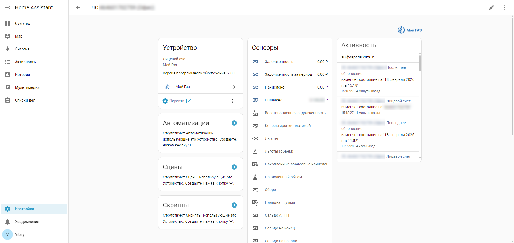

Общий вид устройства счетчика в Home Assistant.

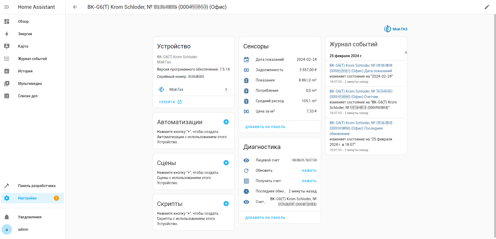

# Сенсоры

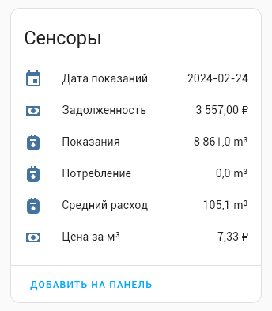

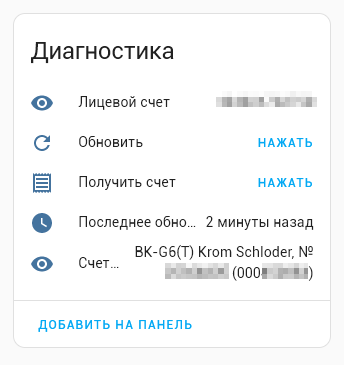

## Сенсоры устройства аккаунта

Для каждого лицевого счета создаются следующие сенсоры:

### Включены по умолчанию
 - `Лицевой счет` — номер лицевого счета
 - `Задолженность` — общая задолженность
 - `Начислено` — начислено за расчетный период
 - `Оплачено` — оплачено за расчетный период
 - `Задолженность за период` — задолженность за расчетный период
 - `Последнее обновление` — время последнего обновления данных

### Отключены по умолчанию

Дополнительные сенсоры расчетного периода можно включить в настройках объекта:
 - `Расчетный период` — название расчетного периода (например, «Январь 2026»)
 - `Дата расчетного периода` — дата расчетного периода
 - `Сальдо на начало` — сальдо на начало периода
 - `Сальдо на конец` — сальдо на конец периода
 - `Начисленный объем` — начисленный объем газа, м³
 - `Оборот` — оборот за период
 - `Списанная задолженность` — списанная задолженность
 - `Плановая сумма` — плановая сумма
 - `Льготы` — сумма льгот
 - `Льготы (объем)` — льготный объем газа, м³
 - `Восстановленная задолженность` — восстановленная задолженность
 - `Корректировки платежей` — корректировки платежей
 - `Сальдо АПГП` — сальдо АПГП на конец периода
 - `Накопленные авансовые начисления` — накопленные авансовые начисления

## Сенсоры устройства услуги

Для каждой услуги в аккаунте создается отдельное устройство с сенсорами:

 - `Balance` — баланс по услуге

Если у услуги есть тарифные ставки (например, газоснабжение с разбивкой по нормативам), для каждой ставки создается дополнительный сенсор:
 - `{название ставки}` — стоимость по тарифу (например, «Плита и колонка(+От)», «Отопление»)

Сенсоры тарифных ставок имеют дополнительные атрибуты:
 - Норматив потребления
 - Цена за м³
 - Дата начала

## Сенсоры устройства счетчика

Для каждого прибора учета создаются дополнительные сенсоры счетчика:
 - `Счетчик` — название прибора учета
 - `Средний расход` — среднемесячный расход газа, м³
 - `Цена за м³` — тариф за кубометр газа
 - `Дата показаний` — дата последней передачи показаний
 - `Показания` — текущие показания счетчика, м³
 - `Потребление` — потребление за последний период, м³

Сенсор `Лицевой счет` имеет дополнительные атрибуты:
 - Площадь жилая
 - Количество проживающих
 - Использование среднегодовых тарифов
 - Наличие горячего водоснабжения
 - Электронная почта
 - Телефон
 - Адрес

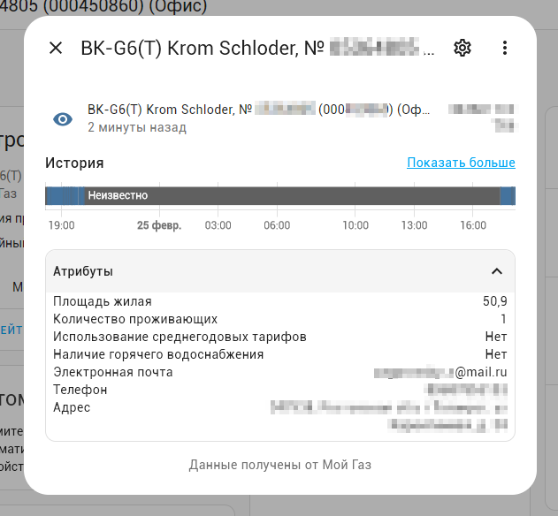

Сенсор `Счетчик` имеет дополнительные атрибуты:

 - Модель
 - Серийный номер
 - Состояние счетчика
 - Тип оборудования
 - Расположение
 - Ресурс
 - Тарифность
 - Дата очередной поверки
 - Плановая дата ТО
 - Дата установки пломбы
 - Дата заводской пломбы
 - Дата изготовления прибора

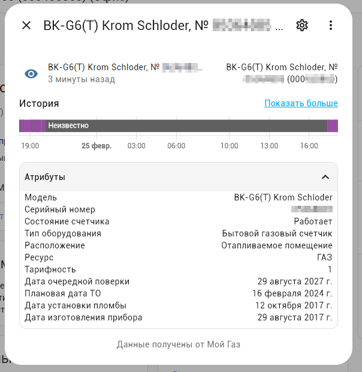

## Кнопки

Кнопки создаются как на устройстве аккаунта, так и на каждом устройстве счетчика:

- **Обновить** - кнопка для немедленного обновления информации
    - Вызывает сервис `mygas.refresh`, сервис обновления информации
- **Получить счет** - кнопка для запроса счета за прошлый месяц
    - Вызывает сервис `mygas.get_bill`, сервис запроса счета за прошлый месяц


# Настройка интервала обновления

После добавления интеграции можно настроить интервал автоматического обновления данных:

1. Перейдите в **Настройки → Устройства и службы → Интеграции → MyGas**
2. Нажмите **Настроить** на карточке интеграции
3. Укажите **Интервал обновления (часы)** — от 1 до 168 (по умолчанию 24 часа)

После сохранения интеграция автоматически перезагрузится с новым интервалом.

# Диагностика

Интеграция поддерживает функцию диагностики Home Assistant. Для скачивания диагностических данных:

1. Перейдите в **Настройки → Устройства и службы → Интеграции → MyGas**
2. Нажмите на три точки (⋮) → **Скачать диагностику**

Конфиденциальные данные (логин, пароль, телефон, email) автоматически скрываются в выгрузке.

# Сервисы

Интеграция Мой Газ публикует три сервиса:

- `mygas.refresh` - сервис обновления информации
- `mygas.get_bill` - сервис получения счета за прошлый месяц
- `mygas.send_readings` - сервис отправки показаний

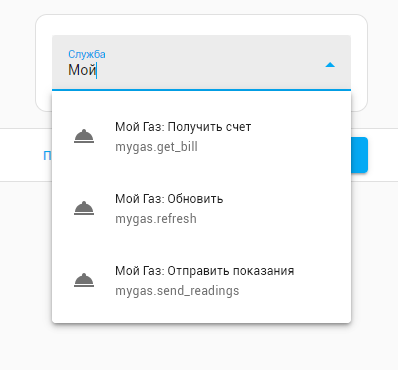

## mygas.refresh - Мой Газ: Обновить информацию

Сервис запрашивает информацию через API и обновляет все сенсоры.

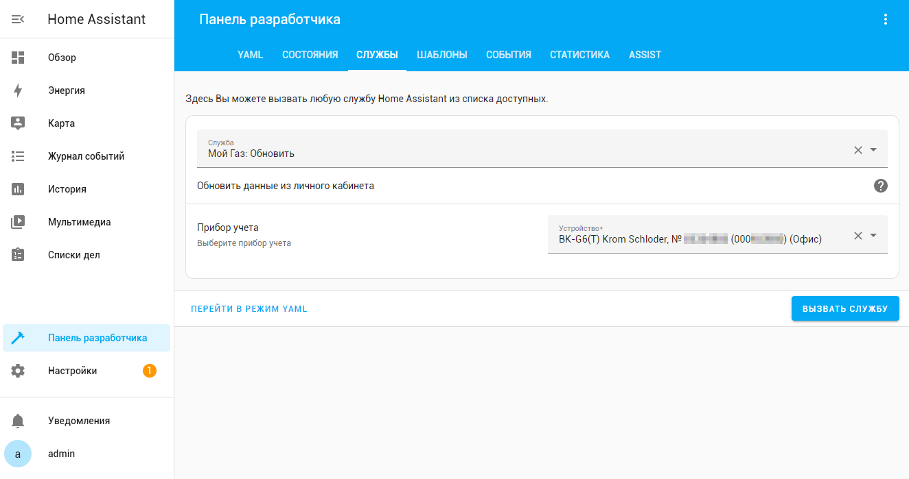

Параметры:

- **device_id** - Устройство (аккаунт или прибор учета)

Вызов сервиса в формате yaml

```yaml
action: mygas.refresh
data:
  device_id: <YOUR_DEVICE_ID>
```

Можно сделать вызов сервиса с использованием имени устройства аккаунта

```yaml
action: mygas.refresh
data:
  device_id: '{{device_id("ЛС 1234567890 (Офис)")}}'
```

или с использованием имени устройства счетчика

```yaml
action: mygas.refresh
data:
  device_id: '{{device_id("BK-G6(T) Krom Schloder, № 05364805 (Офис)")}}'
```

После завершения выполнения сервиса генерируется событие **mygas_refresh_completed**,
в случае ошибки генерируется событие **mygas_refresh_failed**.


## mygas.get_bill - Мой Газ: Получить счет

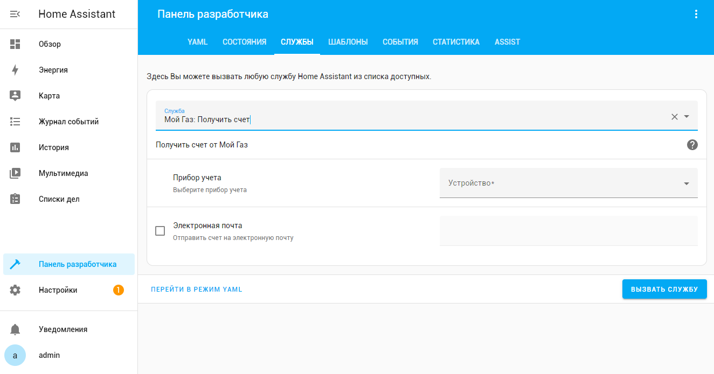

Сервис позволяет запросить счет об оказанных услугах за прошлый месяц (по умолчанию) или на указанную дату.

Параметры:

- **device_id** - Устройство (аккаунт или прибор учета)
- **date** - Дата, на которую запрашивается счет, по умолчанию - первый день прошлого месяца.
- **email** - электронная почта на которую будет отправлен счет, опционально

Вызов сервиса в формате yaml

```yaml
action: mygas.get_bill
data:
  device_id: <YOUR_DEVICE_ID>
```
или с указанием email

```yaml
action: mygas.get_bill
data:
  device_id: <YOUR_DEVICE_ID>
  email: your_email@mail.ru
```
**Если была указана электронная почта, то запрошенный счет придет только на электронную почту**

или с указанием даты

```yaml
action: mygas.get_bill
data:
  device_id: <YOUR_DEVICE_ID>
  date: 2026-01-01
```
Вызов сервиса с указанием даты счета позволяет получить счет за указанный месяц.
В этом случае необходимо указать первый день месяца, за который требуется получить счет.
В случае если дата не указана, то будет получен счет за прошлый месяц.


После завершения выполнения сервиса генерируется событие **mygas_get_bill_completed**,
в случае ошибки генерируется событие **mygas_get_bill_failed**.

## mygas.send_readings - Мой Газ: Отправить показания


Сервис отправляет показания в Мой Газ из указанных сенсоров.

> **Важно:** Сервис `send_readings` принимает только устройство **счетчика**, а не аккаунта.

Параметры:

- **device_id** - Устройство прибора учета (счетчик)
- **value** - Сенсор со значением показаний

Вызов сервиса в формате yaml

```yaml
action: mygas.send_readings
data:
  device_id: <YOUR_DEVICE_ID>
  value: <YOUR_READINGS_SENSOR>
```

После завершения выполнения сервиса генерируется событие **mygas_send_readings_completed**,
в случае ошибки генерируется событие **mygas_send_readings_failed**.

# События

Интеграция генерирует следующие события:

- **mygas_refresh_completed** - сведения обновлены успешно
- **mygas_get_bill_completed** - счет получен успешно
- **mygas_send_readings_completed** - показания отправлены успешно
- **mygas_refresh_failed** - возникла ошибка при обновлении сведений
- **mygas_get_bill_failed** - возникла ошибка при получении счета
- **mygas_send_readings_failed** - возникла ошибка при отправке показаний

## Событие: mygas_refresh_completed - Информация обновлена

После выполнения службы обновления информации генерируется события **mygas_refresh_completed**, со следующими
свойствами:

```yaml
event_type: mygas_refresh_completed
data:
  device_id: <YOUR_DEVICE_ID>
origin: LOCAL
time_fired: "2026-02-25T16:27:46.332645+00:00"
context:
  id: <CONTEXT_ID>
  parent_id: null
  user_id: <YOUR_USER_ID>


```
## Событие: mygas_get_bill_completed - Счет получен

После успешного выполнения службы получения счета генерируется события **mygas_get_bill_completed**, со следующими
свойствами:

```yaml
event_type: mygas_get_bill_completed
data:
  device_id: <YOUR_DEVICE_ID>
  date: "2026-01-01"
  url: >-
    https://example.com/receipt.pdf?signature=xxx
origin: LOCAL
time_fired: "2026-02-25T16:29:07.414544+00:00"
context:
  id: <CONTEXT_ID>
  parent_id: null
  user_id: <YOUR_USER_ID>


```

После успешного выполнения службы получения счета на электронную почту генерируется события **mygas_get_bill_completed**, со следующими
свойствами:

```yaml
event_type: mygas_get_bill_completed
data:
  device_id: <YOUR_DEVICE_ID>
  date: "2026-01-01"
  email: your_email@mail.ru 
origin: LOCAL
time_fired: "2026-02-25T16:29:07.414544+00:00"
context:
  id: <CONTEXT_ID>
  parent_id: null
  user_id: <YOUR_USER_ID>


```

## Событие: mygas_send_readings_completed - Показания отправлены

После успешного выполнения службы отправки показаний генерируется события **mygas_send_readings_completed**, со следующими
свойствами:

```yaml
event_type: mygas_send_readings_completed
data:
  device_id: <YOUR_DEVICE_ID>
  readings: 1806
  sent: true
  message: Показания счетчика успешно переданы
origin: LOCAL
time_fired: "2026-02-25T16:32:02.808445+00:00"
context:
  id: <CONTEXT_ID>
  parent_id: null
  user_id: <YOUR_USER_ID>
```

## Событие: mygas_*_failed - Запрос к сервису выполнился с ошибкой

В случае выполнения сервиса с ошибкой интеграция генерирует следующие события:

- **mygas_refresh_failed** - возникла ошибка при обновлении сведений
- **mygas_get_bill_failed** - возникла ошибка при получении счета
- **mygas_send_readings_failed** - возникла ошибка при отправке показаний

Ниже пример такого события  

```yaml
event_type: mygas_refresh_failed
data:
  device_id: <YOUR_DEVICE_ID>
  error: "Error description"
origin: LOCAL
time_fired: "2026-02-21T17:18:09.428522+00:00"
context:
  id: <CONTEXT_ID>
  parent_id: null
  user_id: <YOUR_USER_ID>
```

# Автоматизации

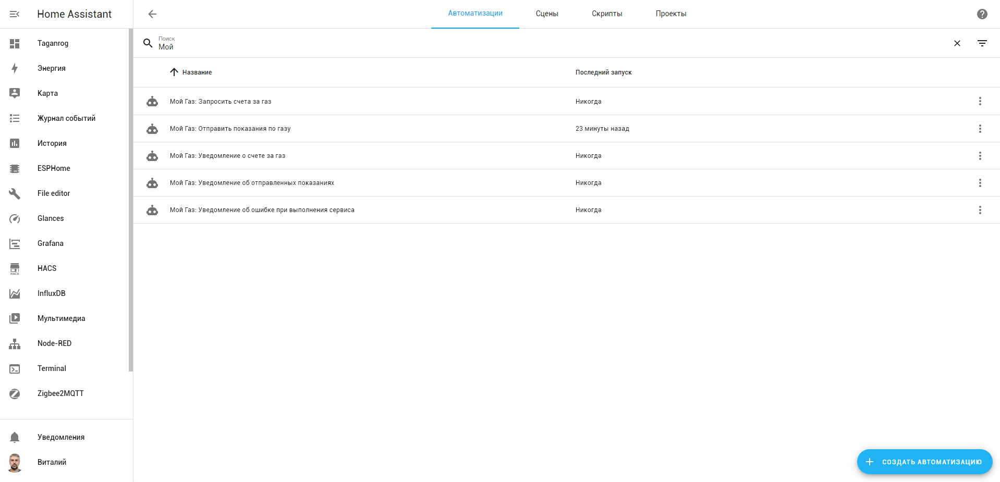

Для отправки показаний и получения счета по расписанию можно создать автоматизации с использованием описанных выше служб, а 
также автоматизации для отправки уведомлений в Телеграм, и веб интерфейс Home Assistant.

## Вызов сервисов по расписанию

Для вызова сервиса по расписанию используется платформа Time с дополнительным условием на дату.

### Отправка показаний в Мой Газ

Показания будут отправляться 24 числа каждого месяца в 2 часа ночи, через час после отправки показаний
будут обновляться сведения лицевого счета.

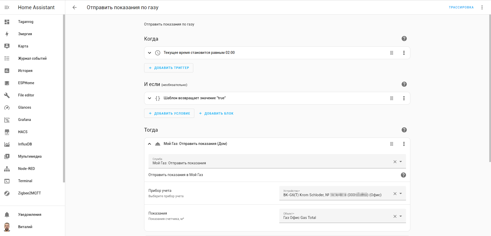

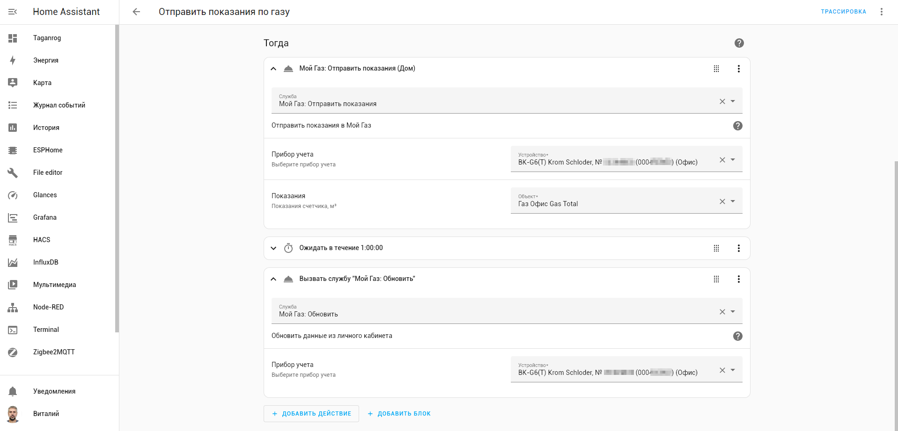

Автоматизация в формате yaml

```yaml
alias: "Мой Газ: Отправить показания по газу"
description: Отправить показания по газу в сервис Мой Газ
triggers:
  - at: "02:00:00"
    trigger: time
conditions:
  - condition: template
    value_template: "{{ now().day == 24 }}"
actions:
  - alias: "Мой Газ: Отправить показания"
    action: mygas.send_readings
    data:
      value: <YOUR_READINGS_SENSOR>
      device_id: <YOUR_DEVICE_ID>
  - delay:
      minutes: 10
  - action: mygas.refresh
    data:
      device_id: <YOUR_DEVICE_ID>
mode: single
```
Вы можете указать свою дату для этого скорректируйте строку `"{{ now().day == 24 }}"`, 
а также можно изменить время для этого в строке `at: "02:00:00"` укажите нужное время.


### Получение счета от Мой Газ

Счет будет запрашиваться 5 числа каждого месяца в 2 часа ночи.

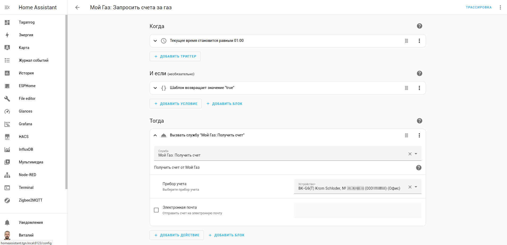

Автоматизация в формате yaml

```yaml
alias: "Мой Газ: Запросить счета за газ"
description: Запрос счета за газ по расписанию
triggers:
  - at: "02:00:00"
    trigger: time
conditions:
  - condition: template
    value_template: "{{ now().day == 5 }}"
actions:
  - action: mygas.get_bill
    data:
      device_id: <YOUR_DEVICE_ID>
mode: single
```
Вы можете указать свою дату для этого скорректируйте строку `"{{ now().day == 5 }}"`,
а также можно изменить время для этого в строке `at: "02:00:00"` укажите нужное время.

### Обновление и получение счета для устройства аккаунта

Сервисы `mygas.refresh` и `mygas.get_bill` можно вызывать как для устройства счетчика, так и для устройства аккаунта.
Это удобно для аккаунтов без приборов учета.

Обновление данных аккаунта и запрос счета будут выполняться 5 числа каждого месяца в 3 часа ночи.

```yaml
alias: "Мой Газ: Обновить данные и запросить счет для аккаунта"
description: Обновление данных и запрос счета для устройства аккаунта
triggers:
  - at: "03:00:00"
    trigger: time
conditions:
  - condition: template
    value_template: "{{ now().day == 5 }}"
actions:
  - action: mygas.refresh
    data:
      device_id: <YOUR_DEVICE_ID>
  - delay:
      minutes: 1
  - action: mygas.get_bill
    data:
      device_id: <YOUR_DEVICE_ID>
mode: single
```

> Замените `<YOUR_DEVICE_ID>` на ID вашего устройства аккаунта. Получить его можно с помощью шаблона:
> `{{device_id("ЛС 1234567890 (Офис)")}}`

> **Важно:** Сервис `mygas.send_readings` требует устройство **счетчика** и не может быть вызван для устройства аккаунта.

## Уведомления

Тригером для отправки уведомлений является соответсвующее событие **mygas_*_completed**.

### Уведомление об отправленных показаниях в Телеграм и веб интерфейс Home Assistant

Автоматизация в формате yaml

```yaml
alias: "Мой Газ: Уведомление об отправленных показаниях"
description: "Уведомление об отправленных показаниях в сервис Мой Газ"
triggers:
  - event_type: mygas_send_readings_completed
    trigger: event
conditions: []
actions:
  - data:
      config_entry_id: <YOUR_TELEGRAM_BOT_CONFIG_ENTRY_ID>  # Replace with your Telegram Bot config entry ID
      message: "Показания: {{ trigger.event.data.readings }}"
      title: >-
        🔥Газ. Показания для {{
        device_attr(trigger.event.data.device_id,'name_by_user') or  
        device_attr(trigger.event.data.device_id, 'name') }} отправлены {{  
        now().strftime('%d-%m-%Y %H:%M') }}
    action: telegram_bot.send_message
  - data:
      title: >-
        🔥Газ. Показания для {{
        device_attr(trigger.event.data.device_id,'name_by_user') or
        device_attr(trigger.event.data.device_id, 'name') }} отправлены {{
        now().strftime("%d-%m-%Y %H:%M") }}
      message: "Показания: {{ trigger.event.data.readings }}"
    action: notify.persistent_notification
mode: single


```
Результат выполнения - сообщение в Телеграм

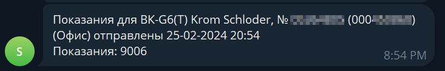

Результат выполнения - уведомление в Home Assistant

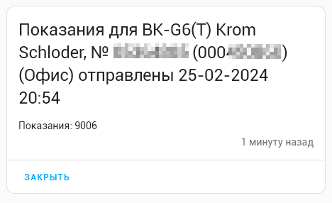

Получить `<YOUR_TELEGRAM_BOT_CONFIG_ENTRY_ID>` можно на странице настроек вашего бота в Home Assistant.

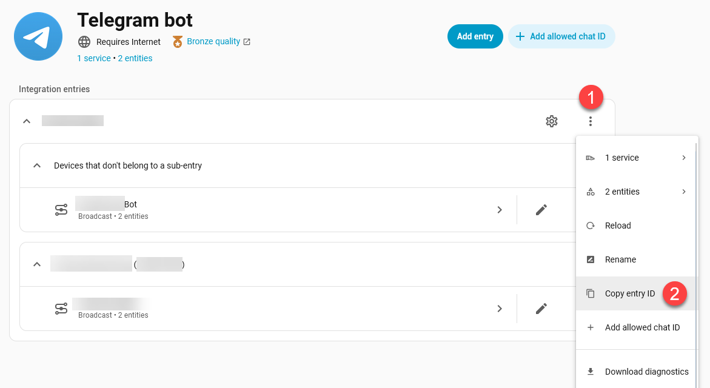

### Уведомления о счете за газ

Автоматизация в формате yaml

```yaml
alias: "Мой Газ: Уведомление о счете за газ"
description: Уведомление о счете за газ от сервиса Мой Газ
triggers:
  - event_type: mygas_get_bill_completed
    trigger: event
conditions:
  - condition: template
    value_template: "{{ trigger.event.data.url != none }}"
actions:
  - data:
      url: "{{trigger.event.data.url}}"
      caption: >-
        🔥Газ. Счет для {{device_attr(trigger.event.data.device_id,
        'name_by_user') or  device_attr(trigger.event.data.device_id, 'name') }}
        за {{trigger.event.data.date}}
      config_entry_id: <YOUR_TELEGRAM_BOT_CONFIG_ENTRY_ID>  # Replace with your Telegram Bot config entry ID
    action: telegram_bot.send_document
  - data:
      message: >-
        Скачать счет для [{{device_attr(trigger.event.data.device_id,
        'name_by_user') or  device_attr(trigger.event.data.device_id, 'name')
        }}]({{trigger.event.data.url}}) за {{trigger.event.data.date}}.
      title: >-
        🔥Газ. Счет для {{device_attr(trigger.event.data.device_id,
        'name_by_user') or  device_attr(trigger.event.data.device_id, 'name') }}
        за {{trigger.event.data.date}}
    action: notify.persistent_notification
mode: single


```

Результат выполнения - сообщение в Телеграм

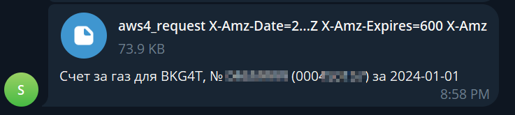

При отправке оповещения в телеграм передается не временная ссылка на сгенерированный счет, а сам счет.

Результат выполнения - уведомление в Home Assistant

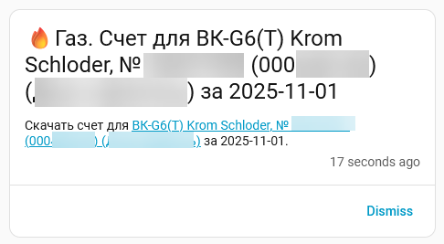

Автоматизация в формате yaml для получения уведомлений об отправке на электронную почту
```yaml
alias: "Мой Газ: Уведомление о счете за газ на электронную почту"
description: Уведомление о счете за газ на электронную почту от сервиса Мой Газ
triggers:
  - event_type: mygas_get_bill_completed
    trigger: event
conditions:
  - condition: template
    value_template: "{{ trigger.event.data.email != none }}"
actions:
  - data:
      message: >-
        🔥Газ. Счет для {{device_attr(trigger.event.data.device_id,
        'name_by_user') or  device_attr(trigger.event.data.device_id, 'name') }}
        за {{trigger.event.data.date}}
      config_entry_id: <YOUR_TELEGRAM_BOT_CONFIG_ENTRY_ID>  # Replace with your Telegram Bot config entry ID
    action: telegram_bot.send_message
  - data:
      message: >-
        🔥Газ. Счет для {{device_attr(trigger.event.data.device_id,
        'name_by_user') or  device_attr(trigger.event.data.device_id, 'name') }}
        за {{trigger.event.data.date}} отправлен на
        {{trigger.event.data.email}}.
    action: notify.persistent_notification
mode: single


```

### Уведомления об ошибках, возникших в процессе выполнения сервиса

Уведомления об ошибках, возникших в процессе выполнения, в Телеграм и веб интерфейс Home Assistant.

```yaml
alias: "Мой Газ: Уведомление об ошибке при выполнения сервиса"
description: Уведомление об ошибке при выполнения сервиса Мой Газ
triggers:
  - event_type: mygas_send_readings_failed
    trigger: event
  - event_type: mygas_get_bill_failed
    trigger: event
  - event_type: mygas_refresh_failed
    trigger: event
conditions: []
actions:
  - data:
      config_entry_id: <YOUR_TELEGRAM_BOT_CONFIG_ENTRY_ID>  # Replace with your Telegram Bot config entry ID
      message: "{{ trigger.event.data.error }}"
      title: >-
        🔥Газ. 
        Ошибка при   передаче показаний для  Ошибка при получении счета для  Ошибка при
        обновлении   информации для  Ошибка при выполнении сервиса для
           {{device_attr(trigger.event.data.device_id,
        'name_by_user') or    device_attr(trigger.event.data.device_id, 'name')
        }} от {{   now().strftime('%d-%m-%Y %H:%M')}}
    action: telegram_bot.send_message
  - data:
      title: >-
        🔥Газ. 
        Ошибка при передаче показаний для  Ошибка при получении счета для  Ошибка при
        обновлении информации для  Ошибка при выполнении сервиса для
         {{device_attr(trigger.event.data.device_id, 'name_by_user')
        or  device_attr(trigger.event.data.device_id, 'name') }}  от {{
        now().strftime('%d-%m-%Y %H:%M')}}
      message: "{{ trigger.event.data.error }}"
    action: notify.persistent_notification
mode: single

```

## Получение счёта за газ с выбором даты через интерфейс

Интеграция `mygas` поддерживает сервис `mygas.get_bill`, который принимает параметры `device_id` и `date`. 
Для удобства можно создать пользовательский интерфейс с выбором даты и кнопкой вызова сервиса.

### Настройка помощника (Helper)

Создайте помощник `input_datetime`, чтобы выбрать дату:

1. Откройте **Settings → Devices & Services → Helpers**
2. Нажмите **+ Create Helper**
3. Выберите **Date**
4. Укажите имя, например: `gas_bill_date`

После этого будет создан объект `input_datetime.gas_bill_date`.


### Создание скрипта

Создайте скрипт `get_gas_bill` (через UI или `scripts.yaml`), который вызывает сервис `mygas.get_bill` с параметрами:

```yaml
sequence:
  - action: mygas.get_bill
    data:
      device_id: <YOUR_DEVICE_ID>
      date: "{{ states('input_datetime.gas_bill_date') }}"
```

> Замените `<YOUR_DEVICE_ID>` на ваш фактический ID устройства.


### Добавление в интерфейс Lovelace

Добавьте следующую карточку в интерфейс Home Assistant (Lovelace UI):

```yaml
type: vertical-stack
cards:
  - type: entities
    entities:
      - entity: input_datetime.gas_bill_date
  - type: button
    name: Получить счёт
    icon: mdi:file-document
    tap_action:
      action: call-service
      service: script.get_gas_bill
    show_name: false
    show_icon: true
    show_state: false
```

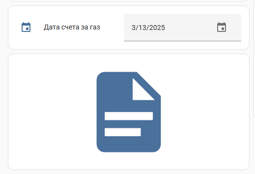

### Использование

1. Выберите дату в календаре
2. Нажмите кнопку **Получить счёт**
3. Сервис `mygas.get_bill` будет вызван с выбранной датой


### Примечание

Подстановки вида `{{ states(...) }}` **не поддерживаются напрямую** в кнопках интерфейса Lovelace. Чтобы передавать параметры с шаблонами, используйте **скрипты**.

## Получение счёта за газ на сегодня

Если вы хотите, чтобы сервис `mygas.get_bill` автоматически запрашивал счёт за сегодня, без выбора даты вручную, 
вы можете создать скрипт или автоматизацию, которая будет передавать текущую дату в формате `YYYY-MM-DD`.

### Скрипт

Создайте следующий скрипт `get_gas_bill_today`:

```yaml
sequence:
  - action: mygas.get_bill
    data:
      device_id: <YOUR_DEVICE_ID>
      date: "{{ now().date() }}"
```

`{{ now().date() }}` возвращает текущую дату в формате YYYY-MM-DD.

### Кнопка в интерфейсе Lovelace

Добавьте кнопку в интерфейс для запуска:

```yaml
type: button
name: Получить счёт за сегодня
icon: mdi:calendar-today
tap_action:
  action: call-service
  service: script.get_gas_bill_today
```

## Возникли проблемы?

Включите ведение журнала отладки, поместив следующие инструкции в файл configuration.yaml:

```yaml
logger:
  default: warning
  logs:
    custom_components.mygas: debug
    aiomygas: debug

```
После возникновения проблемы, пожалуйста, найдите проблему в журнале (/config/home-assistant.log) и
создайте [запрос на исправление](https://github.com/lizardsystems/hass-mygas/issues).

# Дополнительная информация

Эта интеграция использует API [Мой Газ Смородина](https://мойгаз.смородина.онлайн/).
