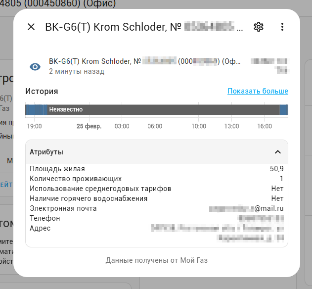
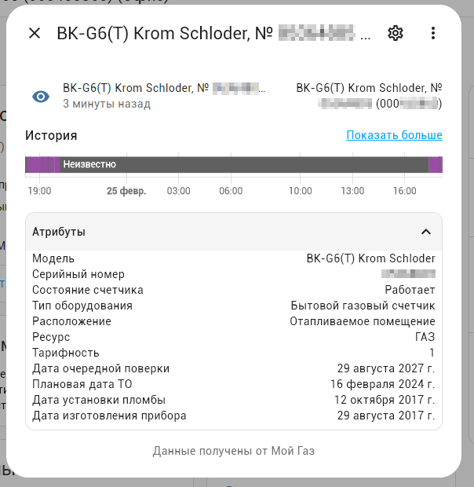

[](https://github.com/hacs/integration)


Этот репозиторий содержит настраиваемый компонент для Home Assistant для отображения данных из сервиса Мой Газ Смородина.

# Установка

**Способ 1.** Через [HACS](https://hacs.xyz/) &rarr; Интеграции &rarr; Добавить пользовательский
репозиторий &rarr; https://github.com/lizardsystems/hass-mygas/ &rarr; **My Gas** &rarr; Установить

**Способ 2.** Вручную скопируйте папку `mygas`
из [latest release](https://github.com/lizardsystems/hass-mygas/releases/latest) в
директорию `/config/custom_components`.

После установки необходимо перегрузить Home Assistant

# Настройка

[Настройки](https://my.home-assistant.io/redirect/config) &rarr; Устройства и службы
&rarr; [Интеграции](https://my.home-assistant.io/redirect/integrations)
&rarr; [Добавить интеграцию](https://my.home-assistant.io/redirect/config_flow_start?domain=mygas) &rarr; Поиск **MyGas**

или нажмите:

[](https://my.home-assistant.io/redirect/config_flow_start?domain=mygas)


Появится окно настройки интеграции, укажите в нем логин и пароль для доступа в личный кабинет в
сервисе [Мой Газ](https://мойгаз.смородина.онлайн/).


Если вы ввели логин и пароль правильно, то появится сообщение об успешном окончании настройки.


После подключения интеграции на закладке интеграции появится новая интеграция "Мой газ"


Также вы можете подключить несколько аккаунтов в интеграции. Они будут отображаться в настройках интеграции отдельными строками


Щелкнув на один из лицевых счетов можно посмотреть устройства или объекты созданные для этого лицевого счета.


Устройством будет каждый счетчик (прибора учета) в аккаунте. Объекты (сенсоры) для каждого лицевого счета

Общий вид устройства в Home Assistant.


# Сенсоры


Создаются следующие объекты для каждого прибора учета:
 - `Лицевой счет`
 - `Задолженность`
 - `Последнее обновление`
 - `Счетчик`
 - `Средний расход`
 - `Цена за м³`
 - `Дата показаний`
 - `Показания`
 - `Потребление`

Сенсор `Лицевой счет` имеет дополнительные атрибуты:
 - Площадь жилая
 - Количество проживающих
 - Использование среднегодовых тарифов
 - Наличие горячего водоснабжения
 - Электронная почта
 - Телефон
 - Адрес



Сенсор `Счетчик` имеет дополнительные атрибуты:

 - Модель
 - Серийный номер
 - Состояние счетчика
 - Тип оборудования
 - Расположение
 - Ресурс
 - Тарифность
 - Дата очередной поверки
 - Плановая дата ТО
 - Дата установки пломбы
 - Дата заводской пломбы
 - Дата изготовления прибора 



## Кнопки

- **Обновить** - кнопка для немедленного обновления информации
    - Вызывает сервис `mygas.refresh`, сервис обновления информации
- **Получить счет** - кнопка для запроса счета за прошлый месяц
    - Вызывает сервис `mygas.get_bill`, сервис запроса счета за прошлый месяц


# Сервисы

Интеграция Мой Газ публикует три сервиса:

- `mygas.refresh` - сервис обновления информации
- `mygas.get_bill` - сервис получения счета за прошлый месяц
- `mygas.send_readings` - сервис отправки показаний


## mygas.refresh - Мой Газ: Обновить информацию

Сервис запрашивает информацию через API и обновляет все сенсоры.


Параметры:

- **device_id** - Устройство Прибор учета

Вызов сервиса в формате yaml

```yaml
service: mygas.refresh
data:
  device_id: 326995f8d0468225a1370b42297380c1
```

Можно сделать вызов сервиса с использованием имени устройства

```yaml
service: mygas.get_bill
data:
  device_id: '{{device_id("ВК-G6(Т) Krom Schloder, № 0XXXXXXX (000XXXXXX) (Офис)")}}'
```

или с использованием одного из сенсоров этого устройства

```yaml
service: mygas.get_bill
data:
  device_id: '{{device_id("sensor.mygas_XXXXXXXXXXXX_counter_XXXXXXXX_XXXX_XXXX_XXXX_XXXXXXXXXXXX_account")}}'
```

После завершения выполнения сервиса генерируется событие **mygas_refresh_completed**,
в случае ошибки генерируется событие **mygas_refresh_failed**.


## mygas.get_bill - Мой Газ: Получить счет


Сервис позволяет запросить счет об оказанных услугах за прошлый месяц.

Параметры:

- **device_id** - Устройство Прибор учета
- **email** - электронная почта на которую будет отправлен счет 

Вызов сервиса в формате yaml

```yaml
service: mygas.get_bill
data:
  device_id: 326995f8d0468225a1370b42297380c1
```
или с указанием емейл

```yaml
service: mygas.get_bill
data:
  device_id: 326995f8d0468225a1370b42297380c1
  email: test@mail.ru
```

После завершения выполнения сервиса генерируется событие **mygas_get_bill_completed**,
в случае ошибки генерируется событие **mygas_get_bill_failed**.

## mygas.send_readings - Мой Газ: Отправить показания


Сервис отправляет показания в ТНС Энерго из указанных сенсоров.

Параметры:

- **device_id** - Устройство Лицевой счет
- **value** - Сенсор со значением потребления

Вызов сервиса в формате yaml

```yaml
service: mygas.send_readings
data:
  device_id: 326995f8d0468225a1370b42297380c1
  value: sensor.mygas_XXXXXXXXXXXX_counter_XXXXXXXX_XXXX_XXXX_XXXX_XXXXXXXXXXXX_readings

```

После завершения выполнения сервиса генерируется событие **mygas_send_readings_completed**,
в случае ошибки генерируется событие **mygas_send_readings_failed**.

# События

Интеграция генерирует следующие события:

- **mygas_refresh_completed** - сведения обновлены успешно
- **mygas_get_bill_completed** - счет получен успешно
- **mygas_send_readings_completed** - показания отправлены успешно
- **mygas_refresh_failed** - возникла ошибка при обновлении сведений
- **mygas_get_bill_failed** - возникла ошибка при получении счета
- **mygas_send_readings_failed** - возникла ошибка при отправке показаний

## Событие: mygas_refresh_completed - Информация обновлена

После выполнения службы обновления информации генерируется события **mygas_refresh_completed**, со следующими
свойствами:

```yaml
event_type: mygas_refresh_completed
data:
  device_id: a05df6bea0854e17027c36a906722560
origin: LOCAL
time_fired: "2024-02-25T16:27:46.332645+00:00"
context:
  id: 01HQGHG1ST4GVCR3FPJVCVTA6X
  parent_id: null
  user_id: 86cc507484e845f7b03f46eeaaab0fa7


```
## Событие: mygas_get_bill_completed - Счет получен

После успешного выполнения службы получения счета генерируется события **mygas_get_bill_completed**, со следующими
свойствами:

```yaml
event_type: mygas_get_bill_completed
data:
  device_id: a05df6bea0854e17027c36a906722560
  date: "2024-01-01"
  url: >-
    https://xn--80asg7a0b.xn--80ahmohdapg.xn--80asehdb/prodcontainerone/xxxxxxxxxxxxx.pdf?X-Amz-Algorithm=AWS4-HMAC-SHA256&X-Amz-Credential=minio_service_user/xxxxxxxx/us-east-1/s3/aws4_request&X-Amz-Date=20240225T162907Z&X-Amz-Expires=600&X-Amz-SignedHeaders=host&X-Amz-Signature=xxxxxxxxxxxxxxxxxxxxxxxxxxxxxxxxxxxxxxxxxxxxxxxxxxxxxxxxxxxxxxxx
origin: LOCAL
time_fired: "2024-02-25T16:29:07.414544+00:00"
context:
  id: 01HQGHJHNGX3GNRNBQDBR7AXRX
  parent_id: null
  user_id: 86cc507484e845f7b03f46eeaaab0fa7


```
## Событие: mygas_send_readings_completed - Показания отправлены

После успешного выполнения службы отправки показаний генерируется события **mygas_send_readings_completed**, со следующими
свойствами:

```yaml
event_type: mygas_send_readings_completed
data:
  device_id: a05df6bea0854e17027c36a906722560
  readings: 1806
  sent: true
  message: Показания счетчика успешно переданы
origin: LOCAL
time_fired: "2024-02-25T16:32:02.808445+00:00"
context:
  id: 01HQGHQW60NNNTZD4GTSN21A8G
  parent_id: null
  user_id: 86cc507484e845f7b03f46eeaaab0fa7
```

## Событие: mygas_*_failed - Запрос к сервису выполнился с ошибкой

В случае выполнения сервиса с ошибкой интеграция генерирует следующие события:

- **mygas_refresh_failed** - возникла ошибка при обновлении сведений
- **mygas_get_bill_failed** - возникла ошибка при получении счета
- **mygas_send_readings_failed** - возникла ошибка при отправке показаний

Ниже пример такого события  

```yaml
event_type: mygas_refresh_failed
data:
  device_id: 326995f8d0468225a1370b42297380c1
  error: "Error description"
origin: LOCAL
time_fired: "2024-02-21T17:18:09.428522+00:00"
context:
  id: 01GYJD548GAG83ZEDVGVCF1WKR
  parent_id: null
  user_id: 386a6cba68ca41a0923d3b94b2710bdc
```

# Автоматизации


Для отправки показаний и получения счета по расписанию можно создать автоматизации с использованием описанных выше служб, а 
также автоматизации для отправки уведомлений в Телеграм, и веб интерфейс Home Assistant.

## Вызов сервисов по расписанию

Для вызова сервиса по расписанию используется платформа Time с дополнительным условием на дату.

### Отправка показаний в Мой Газ

Показания будут отправляться 24 числа каждого месяца в 2 часа ночи, через час после отправки показаний
будут обновляться сведения лицевого счета.


Автоматизация в формате yaml

```yaml
alias: Отправить показания по газу
description: Отправить показания по газу
trigger:
  - platform: time
    at: "02:00:00"
condition:
  - condition: template
    value_template: "{{ now().day == 24 }}"
action:
  - alias: "Мой Газ: Отправить показания (Дом)"
    service: mygas.send_readings
    data:
      value: sensor.waterius_9079912_ch0
      device_id: 5dc83c4fd76017381722d554832464c4
  - delay:
      hours: 1
      minutes: 0
      seconds: 0
      milliseconds: 0
  - service: mygas.refresh
    data:
      device_id: 5dc83c4fd76017381722d554832464c4
mode: single
```
Вы можете указать свою дату для этого скорректируйте строку `"{{ now().day == 24 }}"`, 
а также можно изменить время для этого в строке `at: "02:00:00"` укажите нужное время.


### Получение счета от Мой Газ

Счет будет запрашиваться 5 числа каждого месяца в 2 часа ночи.


Автоматизация в формате yaml

```yaml
alias: Запросить счета за газ
description: ""
trigger:
  - platform: time
    at: "02:00:00"
condition:
  - condition: template
    value_template: "{{ now().day == 5 }}"
action:
  - service: mygas.get_bill
    data:
      device_id: 326995f8d0468225a1370b42297380c1
mode: single
```
Вы можете указать свою дату для этого скорректируйте строку `"{{ now().day == 5 }}"`, 
а также можно изменить время для этого в строке `at: "01:00:00"` укажите нужное время.

## Уведомления

Тригером для отправки уведомлений является соответсвующее событие **mygas_*_completed**.

### Уведомление об отправленных показаниях в Телеграм и веб интерфейс Home Assistant

Автоматизация в формате yaml

```yaml
alias: "Мой Газ: Уведомление об отправленных показаниях"
description: Уведомление об отправленных показаниях в сервис Мой Газ
trigger:
  - platform: event
    event_type: mygas_send_readings_completed
condition: []
action:
  - service: telegram_bot.send_message
    data:
      authentication: digest
      parse_mode: markdown
      title: >-
        Показания для {{
        device_attr(trigger.event.data.device_id,'name_by_user') or
        device_attr(trigger.event.data.device_id, 'name') }} отправлены {{
        now().strftime('%d-%m-%Y %H:%M') }}
      message: "Показания: {{ trigger.event.data.readings }}"
  - service: notify.persistent_notification
    data:
      title: >-
        Показания для {{
        device_attr(trigger.event.data.device_id,'name_by_user') or
        device_attr(trigger.event.data.device_id, 'name') }} отправлены {{
        now().strftime("%d-%m-%Y %H:%M") }}
      message: "Показания: {{ trigger.event.data.readings }}"
mode: single


```
Результат выполнения - сообщение в Телеграм


Результат выполнения - уведомление в Home Assistant


### Уведомления о счете за газ

Автоматизация в формате yaml

```yaml
alias: "Мой Газ: Уведомление о счете за газ"
description: "Уведомление о счете за газ от сервиса Мой Газ"
trigger:
  - platform: event
    event_type: mygas_get_bill_completed
condition: [ ]
action:
  # уведомление в Телеграм
  - service: telegram_bot.send_document
    data:
      authentication: digest
      parse_mode: markdown
      url: >-
        {{trigger.event.data.url}}
      caption: >-
        Счет за газ для
        {{device_attr(trigger.event.data.device_id, 'name_by_user') or 
        device_attr(trigger.event.data.device_id, 'name') }}
        за {{trigger.event.data.date}}
  # уведомление в веб-интерфейсе  
  - service: notify.persistent_notification
    data:
      message: >-
        Скачать счет для 
        [{{device_attr(trigger.event.data.device_id, 'name_by_user') or 
        device_attr(trigger.event.data.device_id, 'name') }}]({{trigger.event.data.url}})
        за {{trigger.event.data.date}}.

      title: >-
        Счет за газ для
        {{device_attr(trigger.event.data.device_id, 'name_by_user') or 
        device_attr(trigger.event.data.device_id, 'name') }}
        за {{trigger.event.data.date}}

mode: single

```

Результат выполнения - сообщение в Телеграм


При отправке оповещения в телеграм передается не временная ссылка на сгенерированный счет, а сам счет.

Результат выполнения - уведомление в Home Assistant


### Уведомления об ошибках, возникших в процессе выполнения сервиса

Уведомления об ошибках, возникших в процессе выполнения, в Телеграм и веб интерфейс Home Assistant.

```yaml
alias: Уведомление об ошибке при выполнения сервиса
description: ""
trigger:
  - platform: event
    event_type: mygas_send_readings_failed
  - platform: event
    event_type: mygas_get_bill_failed
  - platform: event
    event_type: mygas_refresh_failed
condition: [ ]
action:
  # уведомление в Телеграм
  - service: telegram_bot.send_message
    data:
      authentication: digest
      parse_mode: markdown
      title: >-
        
        Ошибка при передаче показаний для
        
        Ошибка при получении счета для
        
        Ошибка при обновлении информации для
        
        Ошибка при выполнении сервиса для
        
        {{device_attr(trigger.event.data.device_id, 'name_by_user') or 
        device_attr(trigger.event.data.device_id, 'name') }}
        от {{ now().strftime('%d-%m-%Y %H:%M')}}
      message: "{{ trigger.event.data.error }}"
  # уведомление в веб-интерфейсе
  - service: notify.persistent_notification
    data:
      title: >-
        
        Ошибка при передаче показаний для
        
        Ошибка при получении счета для
        
        Ошибка при обновлении информации для
        
        Ошибка при выполнении сервиса для
        
        {{device_attr(trigger.event.data.device_id, 'name_by_user') or 
        device_attr(trigger.event.data.device_id, 'name') }} 
        от {{ now().strftime('%d-%m-%Y %H:%M')}}
      message: "{{ trigger.event.data.error }}"

mode: single
```

## Возникли проблемы?

Включите ведение журнала отладки, поместив следующие инструкции в файл configuration.yaml:

```yaml
logger:
  default: warning
  logs:
    custom_components.mygas: debug
    aiomygas: debug

```

После возникновения проблемы, пожалуйста, найдите проблему в журнале (/config/home-assistant.log) и
создайте [запрос на исправление](https://github.com/lizardsystems/hass-mygas/issues).

# Дополнительная информация

Эта интеграция использует API [Мой Газ Смородина](https://мойгаз.смородина.онлайн/).
